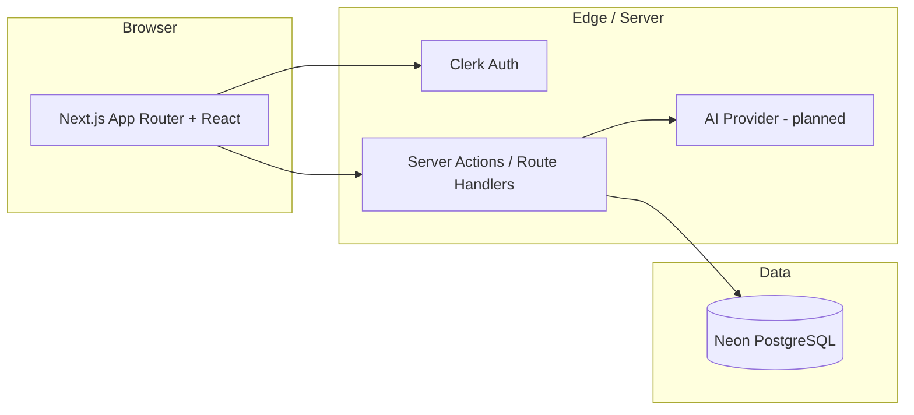

# StudyNova

**AI-powered study notes - from topic to structured notes to self-assessment in seconds.**

StudyNova helps students turn any topic into organized study material and quizzes, instead of spending hours writing and formatting notes by hand. Organize by subject, edit generated content, search your library, and test yourself with AI-generated MCQs.

> **Audience:** Students (college, engineering, placement prep, certifications) and self-learners who want faster revision workflows.

---

## The problem

Students lose time on:

- Manual note-taking and formatting
- Organizing material across subjects
- Building revision summaries and practice questions

Most note apps are **storage-first**. StudyNova is **learning-first**: generate structured content, then revise and quiz from it.

## The solution

A single flow:

**Topic → Structured AI notes → Edit & organize → Quiz → Dashboard stats**

Each generated note follows a consistent outline (overview, key concepts, detailed explanation, real-world examples, interview/exam questions, summary) so revision stays predictable across subjects.

---

## Core features (MVP)

| Area               | What users get                                                           |
| ------------------ | ------------------------------------------------------------------------ |
| **Authentication** | Sign up / sign in; every resource is scoped to the signed-in user        |
| **Subjects**       | Create, rename, list, and delete subject folders (e.g. DBMS, React, DSA) |
| **AI notes**       | Pick a subject + topic → receive structured markdown notes → auto-save   |
| **Notes**          | List by subject, full-text search (title, topic, content), edit, delete  |
| **Quizzes**        | Generate 5–8 MCQs from a note; attempt and see score + review            |
| **Dashboard**      | Totals (subjects, notes, quizzes) and recent activity with quick actions |

Planned nice-to-haves (time permitting): dark mode, export (Markdown/PDF), tags. See [product.md](./product.md) for full requirements, out-of-scope items, and success criteria.

---

## Tech stack

| Layer               | Choice                                                                                    |
| ------------------- | ----------------------------------------------------------------------------------------- |
| **Framework**       | [Next.js 16](https://nextjs.org) (App Router), [React 19](https://react.dev), TypeScript  |
| **UI**              | Tailwind CSS v4, [shadcn/ui](https://ui.shadcn.com), Lucide icons                         |
| **Auth**            | [Clerk](https://clerk.com) (session-based, protected routes via middleware)               |
| **Database**        | [PostgreSQL](https://www.postgresql.org) on [Neon](https://neon.tech) (serverless driver) |
| **ORM**             | [Drizzle ORM](https://orm.drizzle.team) + Drizzle Kit migrations                          |
| **Validation**      | [Zod](https://zod.dev) (API/input schemas in `db/schemas/validation`)                     |
| **AI (planned)**    | Gemini 2.5 Flash + Vercel AI SDK (per product spec)                                       |
| **Deploy (target)** | Vercel                                                                                    |

---

## Project status

| Done                                                | In progress / planned                     |
| --------------------------------------------------- | ----------------------------------------- |
| PostgreSQL schema (users, subjects, notes, quizzes) | App routes (`/dashboard`, notes, quiz UI) |
| Typed query layer with pagination & search          | AI note + quiz generation                 |
| Zod validation for entities                         | Dashboard analytics UI                    |
| Clerk middleware (`proxy.ts`)                       | End-to-end user flows                     |

The **data and auth foundation** is in place; the **product UI and AI integrations** are being built toward the MVP in [product.md](./product.md).

---

## Architecture (high level)



- **Users** are linked to Clerk via `clerk_user_id`; subjects, notes, and quizzes always include `user_id` for authorization.
- **Quizzes** store questions as JSON (`questions_json`) validated with Zod.
- **Notes** support search across title, topic, and content (case-insensitive).

---

## Repository layout

```text
StudyNova/
├── app/                    # Next.js App Router (pages, layout, styles)
├── components/ui/          # shadcn/ui primitives
├── db/
│   ├── schemas/            # Drizzle table definitions + relations
│   ├── schemas/validation/ # Zod schemas
│   └── queries/            # Data access (users, subjects, notes, quizzes)
├── drizzle/                # SQL migrations
├── lib/                    # Shared utilities (e.g. cn)
├── product.md              # Full PRD (features, NFRs, schema reference)
└── proxy.ts                # Clerk middleware for route protection
```

---

## Getting started

### Prerequisites

- **Node.js** 20+
- **pnpm** (recommended; repo uses `pnpm-lock.yaml`)
- **PostgreSQL** connection string ([Neon](https://neon.tech) works well)
- **Clerk** application (publishable + secret keys)

### 1. Clone and install

```bash
git clone <your-repo-url>
cd StudyNova
pnpm install
```

### 2. Environment variables

Copy the example env file and fill in values:

```bash
cp .env.example .env.local
```

| Variable                            | Description                     |
| ----------------------------------- | ------------------------------- |
| `DATABASE_URL`                      | Neon/Postgres connection string |
| `NEXT_PUBLIC_CLERK_PUBLISHABLE_KEY` | From Clerk dashboard            |
| `CLERK_SECRET_KEY`                  | From Clerk dashboard            |

Add any other Clerk variables your app configuration requires (e.g. sign-in/sign-up URLs) per [Clerk’s Next.js docs](https://clerk.com/docs/quickstarts/nextjs).

### 3. Database

```bash
# Apply migrations
pnpm db:migrate

# Optional: open Drizzle Studio
pnpm db:studio

# Optional: seed sample data
pnpm db:seed
```

Other scripts: `pnpm db:generate` (new migration from schema), `pnpm db:push` (push schema without migration files).

### 4. Run locally

```bash
pnpm dev
```

Open [http://localhost:3000](http://localhost:3000).

### 5. Production build

```bash
pnpm build
pnpm start
```

---

## Data model

```text
User ──< Subject ──< Note ──< Quiz
  └──< Note (direct ownership for auth/querying)
```

- **Subject** - `name`, owned by one user; deleting a subject cascades to its notes.
- **Note** - `title`, `topic`, `content` (markdown/text), tied to subject + user.
- **Quiz** - linked to one note; `questions_json` holds MCQ structure (question, options, correct answer).

Detailed field-level spec and page map live in [product.md](./product.md#database-schema).

---

## Scripts

| Command            | Purpose                    |
| ------------------ | -------------------------- |
| `pnpm dev`         | Development server         |
| `pnpm build`       | Production build           |
| `pnpm start`       | Run production server      |
| `pnpm lint`        | ESLint                     |
| `pnpm db:generate` | Generate Drizzle migration |
| `pnpm db:migrate`  | Run migrations             |
| `pnpm db:push`     | Push schema to DB          |
| `pnpm db:studio`   | Drizzle Studio UI          |
| `pnpm db:seed`     | Seed database              |

---

## For recruiters

**What this project demonstrates**

- Full-stack **TypeScript** product thinking (PRD → schema → queries → UI)
- **Next.js App Router** and modern React patterns
- **PostgreSQL** modeling with foreign keys, indexes, and cascade deletes
- **Type-safe** data layer (Drizzle + Zod) and paginated/searchable queries
- **Auth-aware** multi-tenant data (`user_id` on all user content)
- Clear **MVP scope** and explicit out-of-scope list (see [product.md](./product.md))

**Elevator pitch:** StudyNova is an EdTech-style SaaS MVP that uses AI to turn a topic into structured study notes and quizzes, with subject organization and a dashboard-built as a production-minded app, not a toy CRUD demo.

---

## For developers

- Read **[product.md](./product.md)** before implementing features (P0 list, note template, quiz shape, pages).
- Follow **[AGENTS.md](./AGENTS.md)** for Next.js version-specific conventions in this repo.
- Query modules live under `db/queries/`; extend validation in `db/schemas/validation/` before adding new inputs.
- When adding AI, keep the fixed note sections and MCQ JSON shape defined in the PRD so the UI stays consistent.

---

## Documentation

| Document                   | Contents                                                     |
| -------------------------- | ------------------------------------------------------------ |
| [product.md](./product.md) | Product requirements, user journeys, functional/NFR, roadmap |
| [AGENTS.md](./AGENTS.md)   | Agent/contributor rules for this codebase                    |

---

## License

Private project (`"private": true` in `package.json`). Add a license file here if you open-source the repo.
