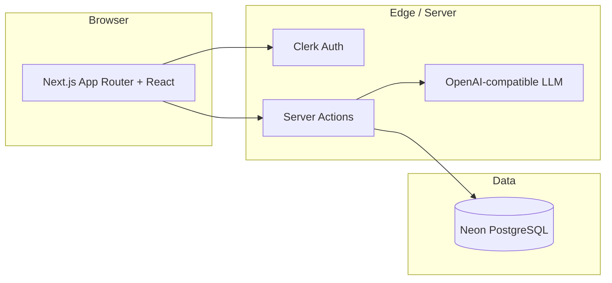

# StudyNova

**AI-powered study notes — from topic to structured notes to self-assessment in seconds.**

StudyNova helps students turn any topic into organized study material and quizzes, instead of spending hours writing and formatting notes by hand. Organize by subject, edit generated content, search your library, and test yourself with AI-generated MCQs.

> **Audience:** Students (college, engineering, placement prep, certifications) and self-learners who want faster revision workflows.

---

## The problem

Students lose time on:

- Manual note-taking and formatting
- Organizing material across subjects
- Building revision summaries and practice questions

Most note apps are **storage-first**. StudyNova is **learning-first**: generate structured content, then revise and quiz from it.

## The solution

A single flow:

**Topic → Structured AI notes → Edit & organize → Quiz → Score & review**

Each generated note follows a consistent outline (overview, key concepts, detailed explanation, real-world examples, interview/exam questions, summary) so revision stays predictable across subjects.

---

## Core features

| Area               | What users get                                                                   |
| ------------------ | -------------------------------------------------------------------------------- |
| **Authentication** | Sign up / sign in via Clerk; every resource is scoped to the signed-in user      |
| **Subjects**       | Create, rename, list, and delete subject folders (e.g. DBMS, React, DSA)         |
| **AI notes**       | Pick a subject + topic → receive structured markdown notes → auto-save           |
| **Notes**          | List by subject, full-text search (title, topic, content), edit, delete          |
| **Quizzes**        | Generate 10 MCQs from any note; attempt, submit, and see score + answer review   |
| **Quiz Attempts**  | Detailed logs of all quiz submissions, listing score, answers, and completion date |
| **Stats & Analytics** | Overall dashboard statistics (average/best percentage, total attempts) and subject breakdown |
| **AI Roadmaps**    | Generate 5-10 step structured learning paths for any topic, with CRUD operations  |
| **Dashboard**      | Totals (subjects, notes, quizzes) and recent activity with quick actions         |

See [product.md](./product.md) for full requirements, out-of-scope items, and success criteria.

---

## Tech stack

| Layer           | Choice                                                                                     |
| --------------- | ------------------------------------------------------------------------------------------ |
| **Framework**   | [Next.js 16](https://nextjs.org) (App Router), [React 19](https://react.dev), TypeScript   |
| **UI**          | Tailwind CSS v4, [shadcn/ui](https://ui.shadcn.com), Lucide icons, `next-themes`           |
| **Auth**        | [Clerk](https://clerk.com) (session-based, protected routes via middleware)                |
| **Database**    | [PostgreSQL](https://www.postgresql.org) on [Neon](https://neon.tech) (serverless driver)  |
| **ORM**         | [Drizzle ORM](https://orm.drizzle.team) + Drizzle Kit migrations                           |
| **Validation**  | [Zod](https://zod.dev) (API/input schemas in `db/schemas/validation`)                      |
| **AI**          | OpenAI-compatible API (configured via `LLM_BASE_URL` + `LLM_MODEL`) via `openai` SDK       |
| **Markdown**    | `react-markdown` for rendering AI-generated note content                                   |
| **Deploy**      | Vercel (target)                                                                            |

---

## Project status

All core MVP features are **built and functional**:

| Feature                              | Status      |
| ------------------------------------ | ----------- |
| PostgreSQL schema (users, subjects, notes, quizzes, attempts, roadmaps) | ✅ Done |
| Typed query layer with pagination & search          | ✅ Done |
| Zod validation for all entities                     | ✅ Done |
| Clerk auth & middleware (`proxy.ts`)                | ✅ Done |
| Landing page                                        | ✅ Done |
| Dashboard (`/app`)                                  | ✅ Done |
| Stats & Performance Analytics (`/app/stats`)        | ✅ Done |
| Subject management UI                               | ✅ Done |
| AI note generation (LLM-backed)                     | ✅ Done |
| Note viewing, editing, deleting                     | ✅ Done |
| AI quiz generation (10 MCQs per note)               | ✅ Done |
| Quiz attempt tracking + score + answer review UI   | ✅ Done |
| AI roadmap generation & CRUD (`/roadmaps`)          | ✅ Done |
| Responsive navigation & logo branding               | ✅ Done |

---

## Architecture (high level)



- **Users** are linked to Clerk via `clerk_user_id`; subjects, notes, and quizzes always include `user_id` for authorization.
- **AI note generation** (`lib/generateNote.ts`) calls an OpenAI-compatible endpoint and validates the response with Zod before saving.
- **AI quiz generation** (`lib/generateQuiz.ts`) generates exactly **10 MCQs** per note, each with 4 options and a 0-indexed `correctAnswer`.
- **Quizzes** store questions as `questions_json` (JSONB) validated with Zod.
- **Notes** support search across title, topic, and content (case-insensitive).

---

## Repository layout

```text
StudyNova/
├── app/                              # Next.js App Router
│   ├── page.tsx                      # Public landing page
│   ├── layout.tsx                    # Root layout (Clerk provider, theme, logo)
│   ├── globals.css                   # Global styles (Tailwind v4)
│   ├── app/
│   │   ├── page.tsx                  # Dashboard (protected, /app)
│   │   └── stats/
│   │       └── page.tsx              # Stats/Analytics dashboard (/app/stats)
│   ├── sign-in/  sign-up/            # Clerk auth pages
│   ├── profile/                      # User profile
│   ├── subjects/                     # Subject list + create
│   │   └── [subjectId]/
│   │       ├── page.tsx              # Subject detail + notes list
│   │       ├── edit/                 # Rename subject
│   │       └── notes/
│   │           ├── new/              # Generate a new AI note
│   │           └── [noteId]/
│   │               ├── page.tsx      # Note viewer + quiz trigger
│   │               ├── quiz/
│   │               │   └── [quizId]/
│   │               │       ├── page.tsx        # Quiz page (server)
│   │               │       └── quiz-attempt.tsx # Quiz UI (client, scores attempt)
│   │               └── generate-quiz-button.tsx
│   ├── roadmaps/                     # AI Learning Roadmaps feature
│   │   ├── page.tsx                  # Roadmaps list page (/roadmaps)
│   │   ├── actions.ts                # Server Actions (create, delete)
│   │   ├── roadmap-form.tsx          # Form component to create a roadmap
│   │   ├── delete-roadmap-button.tsx # Delete button component
│   │   ├── new/
│   │   │   └── page.tsx              # Create roadmap page
│   │   └── [roadmapId]/
│   │       └── page.tsx              # View roadmap details
│   ├── notes/                        # Cross-subject notes search
│   ├── quiz/
│   │   └── actions.ts                # generateQuizAction, submitAttemptAction
│   ├── api/                          # Route handlers (Clerk webhooks etc.)
│   └── components/                   # Shared app-level components (Navbar, etc.)
├── components/ui/                    # shadcn/ui primitives
├── db/
│   ├── schemas/                      # Drizzle table definitions + relations
│   │   ├── quiz-attempts.ts          # Quiz attempts tracking schema
│   │   └── roadmaps.ts               # Learning roadmaps schema
│   ├── schemas/validation/           # Zod schemas (notes, quizzes, users, attempts, roadmaps)
│   └── queries/                      # Data access
│       ├── quiz-attempts.ts          # Analytics and attempts queries
│       └── roadmaps.ts               # Roadmaps database access queries
├── drizzle/                          # SQL migrations
├── lib/
│   ├── generateNote.ts               # AI note generation
│   ├── generateQuiz.ts               # AI quiz generation (10 MCQs)
│   ├── generateRoadmap.ts            # AI roadmap generation
│   ├── generateUsername.ts           # Username helper
│   └── utils.ts                      # cn() utility
├── scripts/seed.ts                   # Database seeder
├── proxy.ts                          # Clerk middleware (route protection)
├── product.md                        # Full PRD
└── AGENTS.md                         # Next.js version-specific conventions
```

---

## Getting started

### Prerequisites

- **Node.js** 20+
- **pnpm** (repo uses `pnpm-lock.yaml`)
- **PostgreSQL** connection string ([Neon](https://neon.tech) works well)
- **Clerk** application (publishable key, secret key, webhook signing secret)
- **OpenAI-compatible LLM** endpoint (e.g. Grok, OpenAI, Ollama, etc.)

### 1. Clone and install

```bash
git clone <your-repo-url>
cd StudyNova
pnpm install
```

### 2. Environment variables

Copy the example env file and fill in values:

```bash
cp .env.example .env
```

| Variable                                        | Description                                             |
| ----------------------------------------------- | ------------------------------------------------------- |
| `DATABASE_URL`                                  | Neon / Postgres connection string                       |
| `NEXT_PUBLIC_CLERK_PUBLISHABLE_KEY`             | From Clerk dashboard                                    |
| `CLERK_SECRET_KEY`                              | From Clerk dashboard                                    |
| `CLERK_WEBHOOK_SIGNING_SECRET`                  | For Clerk webhook handler                               |
| `NEXT_PUBLIC_CLERK_SIGN_IN_URL`                 | `/sign-in`                                              |
| `NEXT_PUBLIC_CLERK_SIGN_UP_URL`                 | `/sign-up`                                              |
| `NEXT_PUBLIC_CLERK_SIGN_IN_FALLBACK_REDIRECT_URL` | `/app`                                                |
| `NEXT_PUBLIC_CLERK_SIGN_UP_FALLBACK_REDIRECT_URL` | `/app`                                                |
| `LLM_API_KEY`                                   | API key for your LLM provider                           |
| `LLM_BASE_URL`                                  | Base URL of the OpenAI-compatible endpoint              |
| `LLM_MODEL`                                     | Model name to use (e.g. `grok-3-mini`, `gpt-4o`, etc.) |

### 3. Database

```bash
# Apply migrations
pnpm db:migrate

# Optional: open Drizzle Studio
pnpm db:studio

# Optional: seed sample data
pnpm db:seed
```

Other scripts: `pnpm db:generate` (generate new migration from schema), `pnpm db:push` (push schema without migration files).

### 4. Run locally

```bash
pnpm dev
```

Open [http://localhost:3000](http://localhost:3000). Sign up, create a subject, and generate your first note.

### 5. Production build

```bash
pnpm build
pnpm start
```

---

## Data model

```text
User ──< Subject ──< Note ──< Quiz ──< QuizAttempt
User ──< Roadmap
```

- **Subject** — `name`, owned by one user; deleting a subject cascades to its notes.
- **Note** — `title`, `topic`, `content` (markdown), tied to subject + user.
- **Quiz** — linked to one note; `questions_json` holds 10 MCQs (question, 4 options, 0-indexed `correctAnswer`).
- **QuizAttempt** — tracks attempts of a quiz by a user; records `score`, `totalQuestions`, `answersJson` (array of selected answers), and completion timestamp.
- **Roadmap** — AI-generated structured learning path for a topic; stores `topic` and `stepsJson` (ordered array of steps containing order, title, and description).

Detailed field-level spec and page map live in [product.md](./product.md#database-schema).

---

## AI integration

All AI features use an **OpenAI-compatible client** (`openai` npm package) pointed at whatever endpoint you configure via `LLM_BASE_URL` and `LLM_MODEL`.

### Note generation (`lib/generateNote.ts`)

- Prompt instructs the model to return JSON `{ title, content }`.
- `content` is markdown with headings, bullet points, examples, and at least 5 exam/interview questions.
- Response is validated with Zod (`aiNoteResponseSchema`) before saving.

### Quiz generation (`lib/generateQuiz.ts`)

- Prompt instructs the model to return JSON `{ questions: [...] }` with **exactly 10 MCQs**.
- Each question: `{ question, options: [A, B, C, D], correctAnswer: 0–3 }`.
- Every question is individually validated with `quizQuestionSchema` (Zod).
- If the model returns anything other than exactly 10 valid questions, an error is thrown and surfaced to the user.

### Roadmap generation (`lib/generateRoadmap.ts`)

- Prompt instructs the model to return JSON `{ steps: [...] }` with 5-10 ordered learning steps.
- Each step: `{ order, title, description }` where steps are logically ordered from foundational to advanced.
- Each step is individually validated with `roadmapStepSchema` (Zod).

---

## Scripts

| Command            | Purpose                    |
| ------------------ | -------------------------- |
| `pnpm dev`         | Development server         |
| `pnpm build`       | Production build           |
| `pnpm start`       | Run production server      |
| `pnpm lint`        | ESLint                     |
| `pnpm db:generate` | Generate Drizzle migration |
| `pnpm db:migrate`  | Run migrations             |
| `pnpm db:push`     | Push schema to DB          |
| `pnpm db:studio`   | Drizzle Studio UI          |
| `pnpm db:seed`     | Seed database              |

---

## For recruiters

**What this project demonstrates**

- Full-stack **TypeScript** product thinking (PRD → schema → queries → server actions → UI)
- **Next.js 16 App Router** — server components, server actions, nested layouts, route groups
- **AI integration** — structured JSON prompting, Zod validation of LLM output, error handling
- **PostgreSQL** modeling with foreign keys, indexes, and cascade deletes
- **Type-safe** data layer (Drizzle + Zod) with paginated and searchable queries
- **Auth-aware** multi-tenant data (`user_id` on all user content, Clerk middleware)
- **End-to-end user flows** — note generation → quiz generation → attempt → score review
- Clear **MVP scope** and explicit out-of-scope list (see [product.md](./product.md))

**Elevator pitch:** StudyNova is an EdTech-style SaaS MVP that uses AI to turn any topic into structured study notes and 10-question quizzes, with subject organization and a learning dashboard — built as a production-minded app, not a toy CRUD demo.

---

## For developers

- Read **[product.md](./product.md)** before implementing features (P0 list, note template, quiz shape, pages).
- Follow **[AGENTS.md](./AGENTS.md)** for Next.js version-specific conventions in this repo.
- Query modules live under `db/queries/`; extend Zod validation in `db/schemas/validation/` before adding new inputs.
- The AI client is a plain `openai` SDK instance — swap `LLM_BASE_URL` and `LLM_MODEL` to point at any compatible provider (OpenAI, Grok, Ollama, etc.) without changing application code.

---

## Documentation

| Document                   | Contents                                                     |
| -------------------------- | ------------------------------------------------------------ |
| [product.md](./product.md) | Product requirements, user journeys, functional/NFR, roadmap |
| [AGENTS.md](./AGENTS.md)   | Agent/contributor rules for this codebase                    |

---

## License

Private project (`"private": true` in `package.json`). Add a license file here if you open-source the repo.
